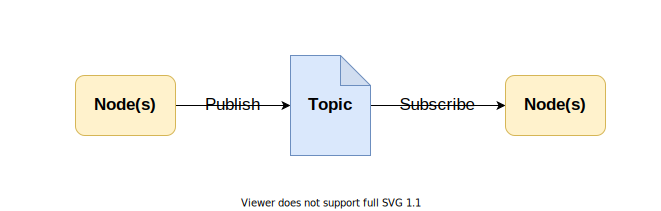

دليل لتثبيت ROS Noetic على نظام وهمي بالاضافة الى راسبيري باي 4 (اوبنتو 20.04)

لبيليب

---

A guide to install ROS Noetic Installation Guide on both **Virtual Machine** and **Raspberry Pi 4** (Ubuntu Focal Fossa 20.04)

## Introduction 

Robot Operating System (ROS) is an open-source meta operating system, so it works on top of an operating system (Usually Unix-based). It provides libraries and tools to ease the process of developing robtics in the real world. One of the thing ROS provides is a system for message passing.

### Message Passing
Message Passing is a way for multiple process (known as nodes or services) to communcate. The system mainly consist of 3 parts.

- Topic
 - Publisher
 - Subscribers

> ***Topic*** can be simplfied as a structure to hold a specific kind of data. So for example if we are intrested in information related to weather, the topic may hold data such as temperature, wind speed and humidity. 

> ***Publisher*** is one or multiple nodes (processes) that sends the data to a topic. In our example that can be seen as a Python or C++ node (process) collecting data from sensors connected to a device and send it to the topic.

> ***Subscribers*** is one or multipe nodes (processes) that reads the data from a topic. In our example that can be another device in the network that reads the weather data and control other appliances such as a fan or AC.

There are a two important notes:
- Message Passing can work (in a network) with multiple devices (hosts) each one may have multiple nodes.
- The publishers and subscribers can have different relationships with the topic for example
	- one-to-one
	- one-to-many
	- many-to-one
	- many-to-many
### ROS Installation
- [Ubuntu Virtual Machine]()
- [Raspberry Pi 4]()

### References
- [ROS Official Website]()
