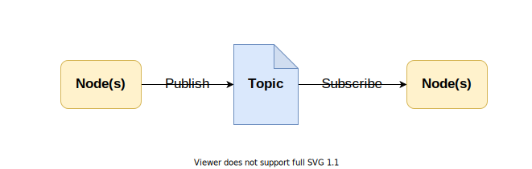

دليل لتثبيت ROS Noetic على نظام وهمي بالاضافة الى راسبيري باي 4 (اوبنتو 20.04)

## 
المقدمة

نظام تشغيل الروبوت او ما يعرف ب ROS هو نظام فوقي مفتوح المصدر, بالتالي هو يعمل فوق نظام التشغيل (بالعادة نظم شبيهة بنظام يونكس). النظام يوفر مكتبات وأدوات تسهل عملية تطوير الروبوتات. أحد مزايا النظام هي توفير نظام للتراسل.

### 
نظام التراسل

نظام المراسلة يوفر طريقة للتواصل بين عدة عمليات (تسمى بالعقد او الخدمات). النظام يتكون من 3 أجزاء رئيسية.

<ul>
  <li>الموضوع</li>
  <li>الناشرين</li>
  <li>المشتركين</li>
</ul>

> 
الموضوع يمكن تمثيله على انه هيكل لمجموعة محددة من البيانات. كمثال اذا كنا مهتمين ببيانات الطقس فسيكون الموضوع يحتوي على بيانات مثل الحرارة وسرعة الرياح والرطوبة.

> 
الناشر قد يكون عبارة عن عملية أو أكثر (عقدة/عقد) تقوم بارسال البيانات لموضوع محدد. الناشر قد يكون عبارة عن برنامج كتب بلغة البايثون أو السي++ ويقوم بقراءة بيانات من عدة حساسات متصلة بالجهاز ويقوم بنشرها للموضوع.

> 
المشترك قد يكون عبارة عن عملية أو أكثر (عقدة/عقد) تقوم بقراءة البيانات من الموضوع. في سياق هذا المثال قد يكون جهاز آخر يقوم بقراءة بيانات الطقس ويتحكم في أجهزة مختلفة مثل المكيف أو المروحة.

ملاحظات مهمة: 

<ul>
  <li>نظام التراسل يمكن أن يعمل داخل الشبكة بين أكثر من جهاز يحتوي على نظام ROS. كل جهاز قد يحتوي على أكثر من عملية أو موضوع.</li>
  <li>العلاقة بين الناشر والمشترك بموضوع قد تكون بأكثر من شكل</li>
  <ul>
      <li>ناشر لمشترك</li>
      <li>ناشر لعدة مشتركين</li>
      <li>عدة ناشرين لمشترك</li>
      <li>عدة ناشرين لعدة مشتركين</li>
   </ul>
</ul>

### 
تثبيت ROS

- [
أوبونتو على نظام أفتراضي
](Ubuntu-Virtual-Machine.md)
- [
الراسبيري باي 4
]()

### 
مصادر

- [
الموقع الرسمي لـ ROS
](https://www.ros.org/)

---

A guide to install ROS Noetic Installation Guide on both **Virtual Machine** and **Raspberry Pi 4** (Ubuntu Focal Fossa 20.04)

## Introduction 

Robot Operating System (ROS) is an open-source meta operating system, so it works on top of an operating system (Usually Unix-based). It provides libraries and tools to ease the process of developing robtics in the real world. One of the thing ROS provides is a system for message passing.

### Message Passing

Message Passing is a way for multiple process (known as nodes or services) to communcate. The system mainly consist of 3 parts.

- Topic
- Publisher
- Subscribers

> ***Topic*** can be simplfied as a structure to hold a specific kind of data. So for example if we are intrested in information related to weather, the topic may hold data such as temperature, wind speed and humidity. 

> ***Publisher*** is one or multiple nodes (processes) that sends the data to a topic. In our example that can be seen as a Python or C++ node (process) collecting data from sensors connected to a device and send it to the topic.

> ***Subscribers*** is one or multipe nodes (processes) that reads the data from a topic. In our example that can be another device in the network that reads the weather data and control other appliances such as a fan or AC.

There are a two important notes:
- Message Passing can work (in a network) with multiple devices (hosts) each one may have multiple nodes.
- The publishers and subscribers can have different relationships with the topic for example
	- one-to-one
	- one-to-many
	- many-to-one
	- many-to-many
### ROS Installation
- [Ubuntu Virtual Machine](Ubuntu-Virtual-Machine.md)
- [Raspberry Pi 4]()

### References
- [ROS Official Website](https://www.ros.org/)
