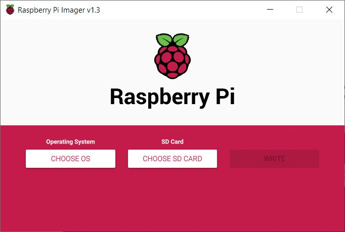
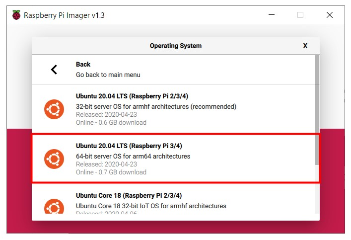
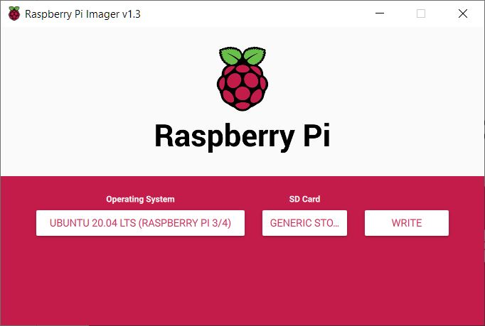
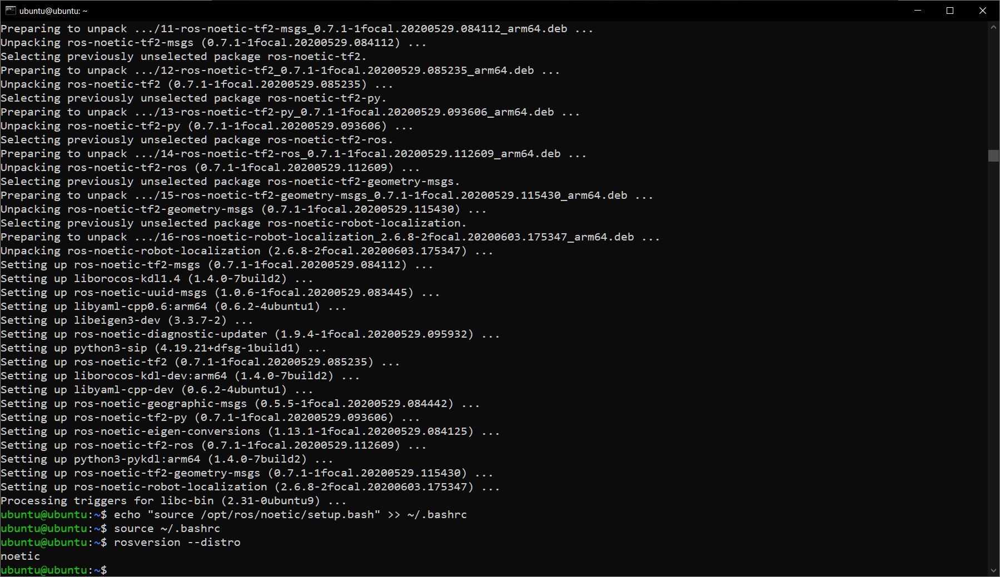

# ROS Installation on Raspberry Pi 4

## Requirements
- Raspberry Pi 4
- Micro-HDMI to HDMI
- USB type-c power cable
- Ethernet cable
- Keyboard
- Micro-SD Card (8 GB recommended)
- [Raspberry Pi Imager](https://www.raspberrypi.org/downloads/)

## Installation Steps

### 1.1 Connect the Micro-SD card and install Ubuntu 20.04 Server 64-Bit
1. Select the OS
2. Select the Micro-SD Card
3. Click WRITE

### 1.2 After writing the image to the memory card. Connect it to the Pi, also connect the ethernet and keyboard and power cable.

### 1.3 Login to pi using the following credentials
> Username: ubuntu
> Password: ubuntu

After entring the credentials, The OS will ask you to change the password.

### 1.4 Run the following commands to install ROS (ROS-Base\Bare Bones)
> **Note: We are installing the ROS-Base Version (CLI only, No GUI tools.)**

> sudo sh -c 'echo "deb http://packages.ros.org/ros/ubuntu $(lsb_release -sc) main" > /etc/apt/sources.list.d/ros-latest.list'

> sudo apt-key adv --keyserver 'hkp://keyserver.ubuntu.com:80' --recv-key C1CF6E31E6BADE8868B172B4F42ED6FBAB17C654

> sudo apt update

> sudo apt install ros-noetic-desktop-full

> echo "source /opt/ros/noetic/setup.bash" >> ~/.bashrc

> source ~/.bashrc

### 2.4 Run the following command to check if ROS installed successfully.

> rosversion --distro

The output should be

> noetic

## Resource

