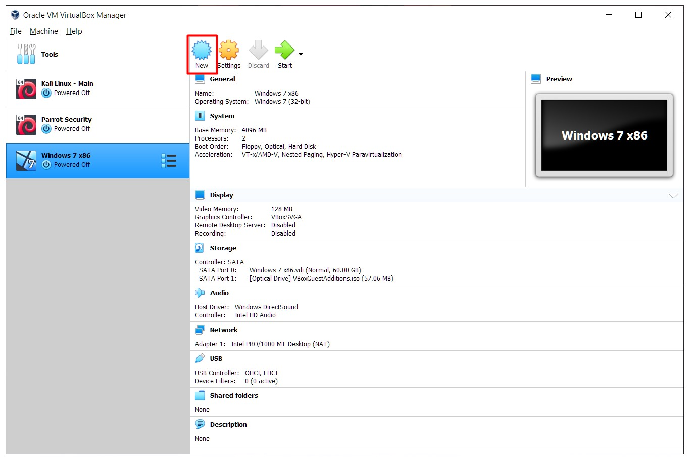
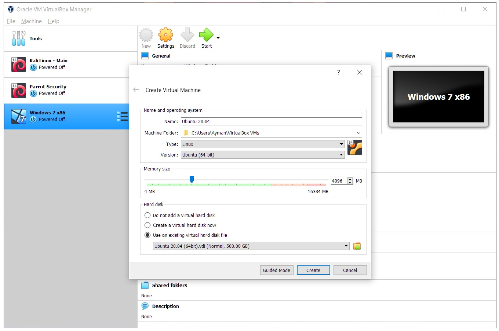
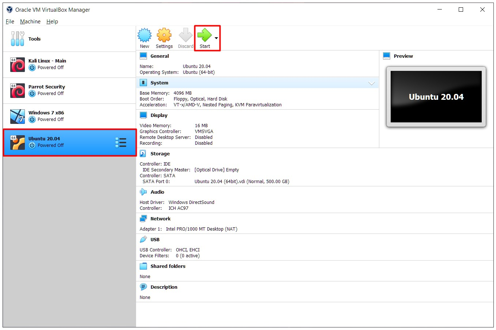
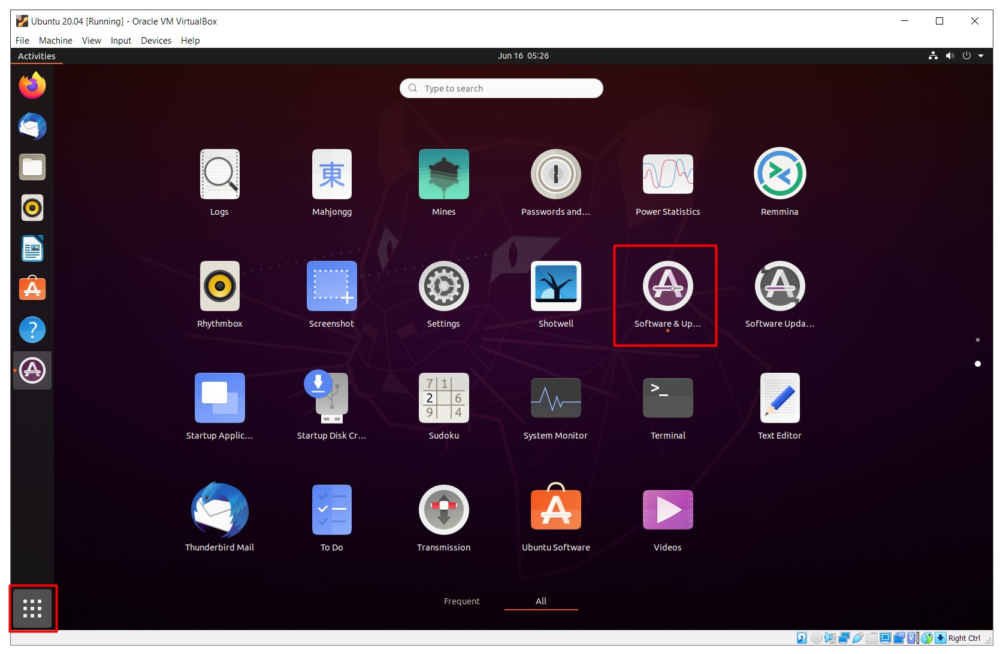
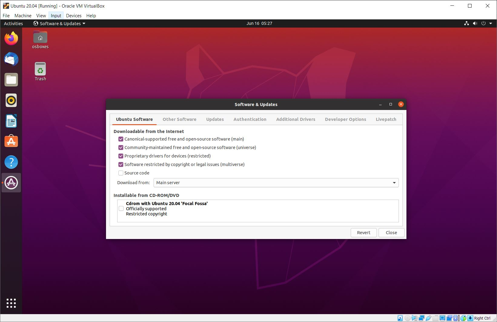

# ROS Installation on Ubuntu Virtual Machine

## Requirements
- [Oracle VM VirtualBox](https://www.virtualbox.org/)
- [Ubuntu 20.04 Virtual Disk Image (VDI) File](https://www.osboxes.org/ubuntu/)

## Installation Steps

### 1. Ubuntu Installation

**1.1** Start Oracle VM VirtualBox Manager application, and click New.

**1.2** A new window will popup, a few settings need to set.
- Name: Write the name of the Virtual Machine.
- Type: Set it to **Linux**.
- Version: Set it to **Ubuntu (64-bit)**.
- Memory Size: 4 GiB (4096 MB) is recommended.
- Hard disk:
  - Select **Use an existing virtual hard disk file**
  - Click the folder icon next to the dropdown menu and add the VDI file downloaded earlier, and make sure it is selected in the menu.
 

**1.3** Click on the virtual machine you just created, and click **Start** on the top.

### 2. ROS Installation

**2.1** After the operating system starts, log in using this password
> osboxes.org

**2.2** Click **Show Applications** on the left bottom corner, and run **Software & Updates** and make sure the top 4 checkboxes are checked and download from is set to Main Server. Then click Close, and Reload.

**2.3** Click on **Show Applications** on the left bottom corner and run **Terminal**

Then run the following commands.

> sudo sh -c 'echo "deb http://packages.ros.org/ros/ubuntu $(lsb_release -sc) main" > /etc/apt/sources.list.d/ros-latest.list'

> sudo apt-key adv --keyserver 'hkp://keyserver.ubuntu.com:80' --recv-key C1CF6E31E6BADE8868B172B4F42ED6FBAB17C654

> sudo apt update

> sudo apt install ros-noetic-desktop-full

> echo "source /opt/ros/noetic/setup.bash" >> ~/.bashrc

> source ~/.bashrc

**2.4** Run the following command to check if ROS installed successfully.

> rosversion -d

The output should be

> Noetic.

## References
[ROS Noetic Official Tutorial](http://wiki.ros.org/noetic/Installation/Ubuntu)
